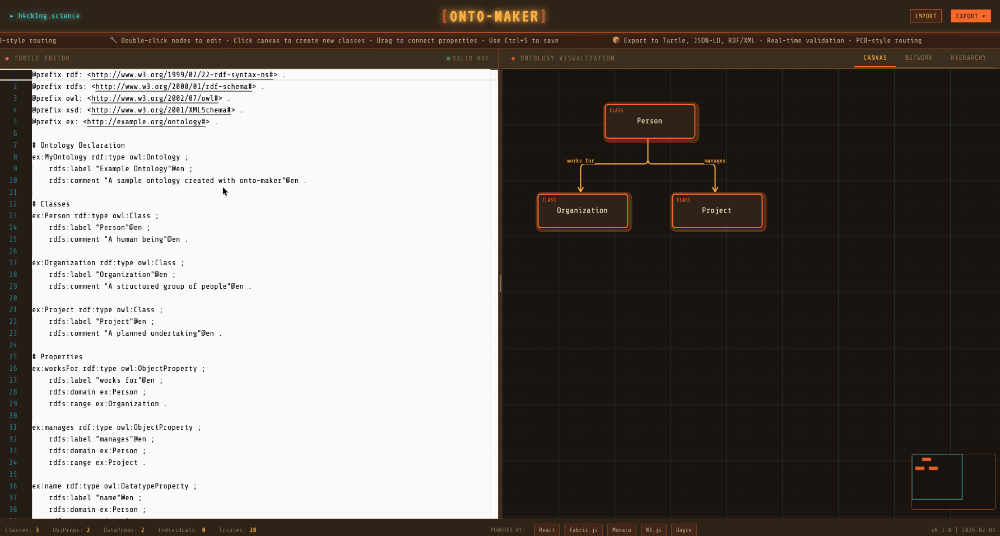
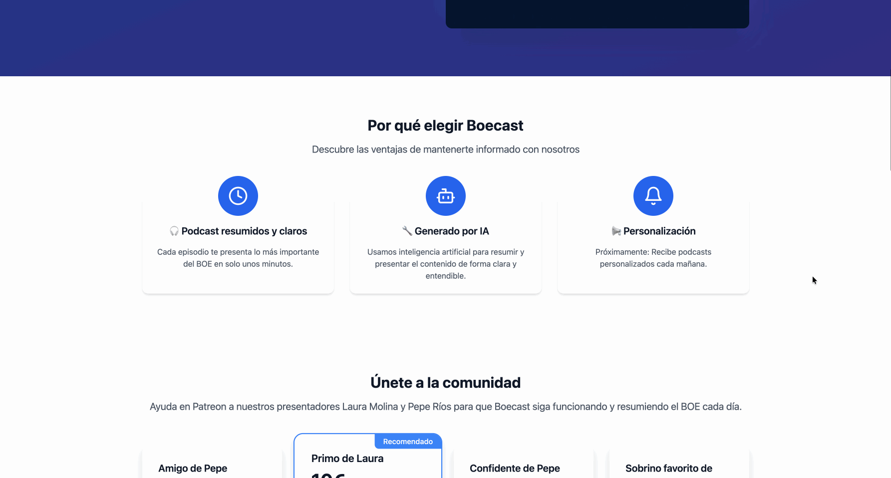

## Carlos Vivar Rios

Hi! I'm Carlos, a **Biologist** and **Data Engineer** with experience in **genomics**, **microscopy & satellite multidimensional image analysis**, **cellular biology modeling**, **AI stuff**, and **web development**. Currently, I am working as a **Senior Data Engineer** at the **Swiss Data Science Center** at **EPFL**. I love learning new things, and I'm completely addicted to participating in hackathons with extraordinary minds :).

---

Check my full portfolio at [h4ck1ng.science](https://h4ck1ng.science)

### Current Main Projects

- **Open Pulse:** [Open Pulse](https://sdsc-ordes.github.io/open-pulse/)
    - Platform for monitoring Research Open Source Repositories
- **Imaging plaza:** [Imaging Plaza](https://www.datascience.ch/resources/imaging-plaza)
- **SDSC-Hackathons:** [SDSC Hackathons](https://sdsc-hackathons.ch/)
- **ODTP:** [Open Digital Twin Platform](https://odtp-org.github.io/)

---

### Latest side-hustle projects

<!-- HASHNODE:START -->
<table>
  <tr>
    <td width="50%" valign="top">
      
      <h4>JSON-LD Editor</h4>
      
Interactive editor to create, validate, and explore JSON-LD graphs quickly.

      
<a href="https://www.caviri.github.io/jsonld-editor/">Live demo</a> • <a href="https://github.com/caviri/jsonld-editor">Repository</a>

    </td>
    <td width="50%" valign="top">
      
      <h4>Onto-maker</h4>
      
Lightweight ontology sketchpad for turning ideas into structured vocabularies.

      
<a href="https://www.caviri.github.io/onto-maker/">Live demo</a> • <a href="https://github.com/caviri/onto-maker/tree/main">Repository</a> (code available soon)

    </td>
  </tr>
  <tr>
    <td width="50%" valign="top">
      
      <h4>Boecast.es</h4>
      
A focused space for short spanish law updates and podcast-style explainers.

      
<a href="https://boecast.es">Visit boecast.es</a>

    </td>
    <td width="50%" valign="top">
      
      <h4>JSON2MD</h4>
      
Converts JSON structures into clean, readable Markdown documents.

      
<a href="https://h4ck1ng.science/json2md/">Live demo</a> • <a href="https://github.com/h4ck1ng-science/json2md">Repository</a>

    </td>
  </tr>
</table>

---

---

My brain is open :)

<!-- 

<!--  -->

<!-- *Profile page inspired by [giswqs](https://github.com/sponsors/giswqs?success=true) :) -->
